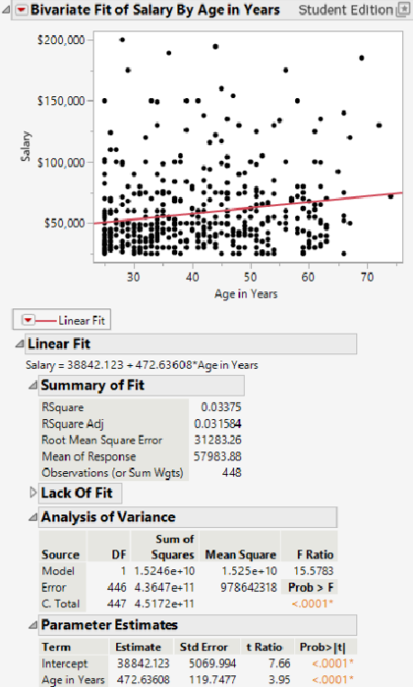

# Consumer Behavior Predictive Analytics

This project uses JMP to perform descriptive and predictive analytics on consumer behavior data through clustering, regression analysis, decision trees, and multivariate visualizations.

## Tools Used
- JMP
- Predictive Analytics
- Regression Analysis
- K-Means Clustering
- Decision Trees
- Data Visualization

## Business Problem
Organizations use consumer analytics to understand purchasing behavior, demographic patterns, customer segmentation, and purchasing trends. This project applies predictive analytics techniques to identify consumer behavior patterns and support data-driven business decision-making.

## Project Overview
The analysis explores consumer behavior patterns, salary trends, purchasing behavior, and oral hygiene habits using JMP. The project includes descriptive analysis, K-Means clustering, regression modeling, decision tree classification, and multivariate visualization.

## Analytical Techniques
- Decision Tree Modeling
- K-Means Clustering
- Linear Regression
- Descriptive Analytics
- Predictive Analytics
- Multivariate Visualization

## Key Features
- Developed a decision tree model to identify factors influencing brushing behavior across demographic groups
- Performed regression analysis to evaluate relationships between salary and age
- Applied K-Means clustering to segment consumers based on demographic and behavioral characteristics
- Created multivariate visualizations to explore consumer behavior patterns
- Interpreted model performance using R-squared, RMSE, regression coefficients, and clustering insights

## Business Value
The analysis demonstrates how predictive analytics can identify customer segments, behavioral trends, and purchasing patterns to support data-driven business decision-making.

## Skills Demonstrated
- Predictive Analytics
- Data Analysis
- Regression Analysis
- K-Means Clustering
- Decision Tree Modeling
- Data Visualization
- Business Analysis

## Analysis Results

### Decision Tree

### K-Means Clustering

### Regression Analysis

