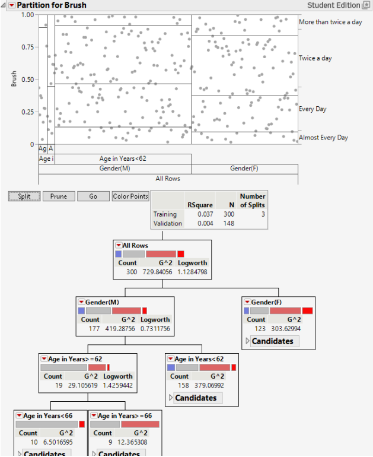
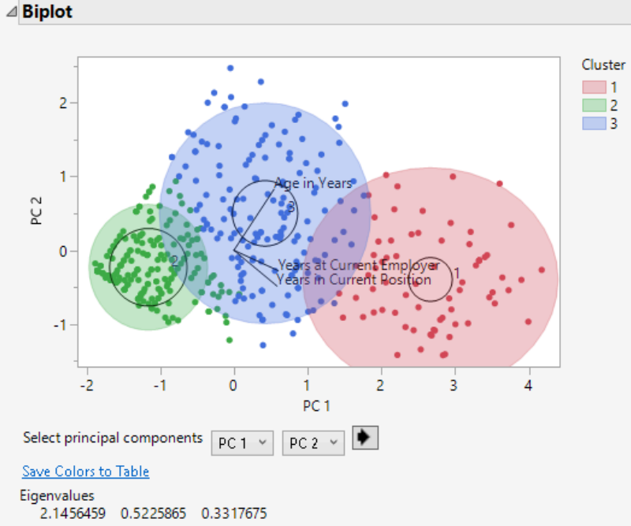

# Consumer Behavior Predictive Analytics
This project uses JMP to analyze consumer and workforce data through predictive analytics techniques including decision trees, K-Means clustering, principal component analysis (PCA), and linear regression.

## Tools Used
- JMP
- Predictive Analytics
- Decision Trees
- K-Means Clustering
- Principal Component Analysis (PCA)
- Linear Regression
- Data Visualization

## Business Problem
Organizations use predictive analytics to identify customer segments, understand behavioral patterns, evaluate demographic relationships, and support data-driven business decisions. This project applies multiple analytical techniques to uncover meaningful patterns within consumer and workforce datasets.

## Project Overview
The project applies predictive analytics techniques to analyze relationships between demographic characteristics, salary, employment experience, and consumer behavior. It includes decision tree modeling, K-Means clustering, principal component analysis (PCA), and linear regression to identify patterns and support business decision-making.

## Analytical Techniques
- Decision Tree Modeling
- K-Means Clustering
- Principal Component Analysis (PCA)
- Linear Regression
- Descriptive Analytics

## Key Features
- Developed a decision tree model to identify factors influencing brushing behavior across demographic groups
- Applied K-Means clustering to identify distinct customer and workforce segments
- Performed principal component analysis (PCA) to visualize multidimensional relationships between variables
- Built a linear regression model to evaluate the relationship between salary and age
- Interpreted model performance using R-squared, regression coefficients, clustering outputs, and principal component analysis

## Business Value
The analysis demonstrates how predictive analytics can identify behavioral patterns, customer segments, demographic trends, and variable relationships to support data-driven business decision-making.

## Skills Demonstrated
- Predictive Analytics
- Decision Tree Modeling
- K-Means Clustering
- Principal Component Analysis (PCA)
- Linear Regression
- Data Analysis
- Data Visualization
- Business Analysis

## Analysis Results

### Decision Tree
The decision tree identifies demographic characteristics associated with brushing frequency.

### K-Means Clustering
Three distinct clusters were identified to segment observations based on demographic and employment characteristics.

### Linear Regression
Linear regression evaluates the relationship between salary and age, providing regression coefficients and model performance statistics.

